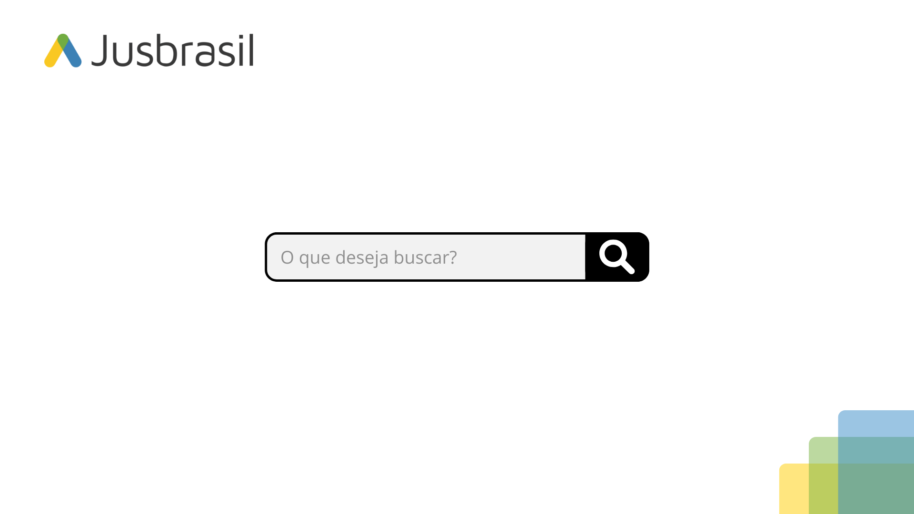
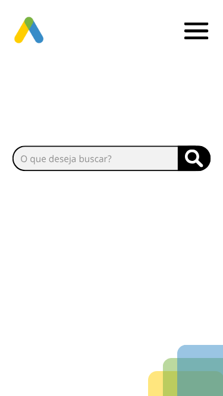

# Desafio Autocompletar na busca

Esse desafio visa criar uma barra de pesquisa integrada com o back-end, que dará sugestões de pesquisa para o usuário.

Para executar: ```docker-compose up --build```

## Design

Design foi feito no Canva, visando trazer a identidade visual da JusBrasil para o projeto.

### Desktop



### Mobile

